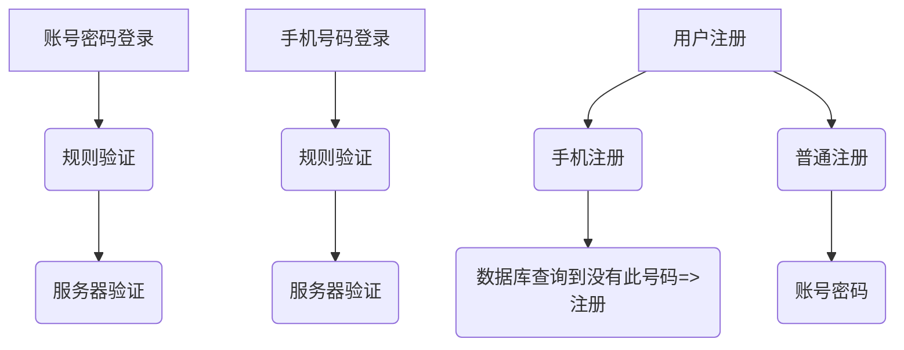
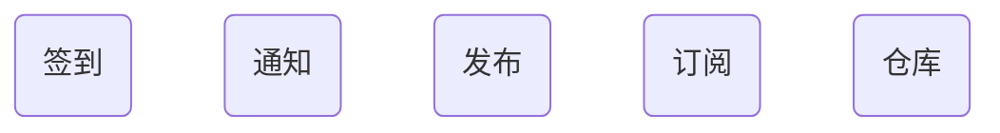
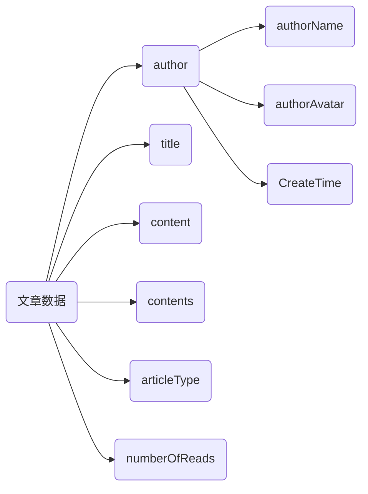

## 我的微信小程序项目

### 底部导航栏

> 首页
>
> > house
> >
> > 
>
> 订阅
>
> > lightBulb
> >
> > 
>
> 添加
>
> > plus-circle
> >
> > 
>
> 发现
>
> > columns-gap
> >
> > 
>
> 仓库
>
> > collection
> >
> > 


顺序是 

- 首页
- 发现
- 添加
- 订阅
- 仓库


### UI风格

参考了YouTube移动端的UI

登录ui参考手机qq，

滑块参考了酷我音乐

输入光标的颜色修改 [caret-color - CSS: Cascading Style Sheets | MDN (mozilla.org)](https://developer.mozilla.org/en-US/docs/Web/CSS/caret-color)


#### 坑

调试调用云函数就会报错，原因只能是调用本地云函数


[移动设备上的无障碍 - 学习 Web 开发 | MDN (mozilla.org)](https://developer.mozilla.org/zh-CN/docs/Learn/Accessibility/Mobile)


### 登录


用的是uni-forms组件，自定义验证规则





minx写入全局，方便在任何页面都能使用

### 导航守卫 需要登录才能使用的地方




禁止输入中文

[禁止在input中输入中文 - 腾讯云开发者社区-腾讯云 (tencent.com)](https://cloud.tencent.com/developer/article/1639900#:~:text=提示：设置ime,粘贴和拖放无效。)


### uni-forms组件

- 注意最外层 uni-forms 必须绑定主要的数据 :modelValue="loginData"
- uni-forms-item 必须绑定规则名字
- 内部输入框必须绑定和 最外层uni-forms 相同的数据

```html
<uni-forms class="form" ref="form" :rules="userRules" :modelValue="loginData">
    <!-- 账号 -->
    <uni-forms-item name="loginName">
        <input type="text" aria-label="账号输入框" v-model="loginData.loginName" maxlength="20" role="input"
               placeholder="请输入账号" placeholder-class="placeholder" class="form-input">
    </uni-forms-item>
    <!-- 密码 -->
    <uni-forms-item name="password">
        <input type="password" maxlength="20" v-model="loginData.password" aria-label="密码输入框" role="password" placeholder="请输入密码"
               placeholder-class="placeholder" class="form-input">
    </uni-forms-item>
</uni-forms>

<script>
    data() {
        return {
            loginData: {
                loginName: '',
                password: '',
            }
        }
    },
</script>
```


今日技巧，选中typora中代码，tab + shift 快速对齐


```JavaScript
await this.$refs.form.validate().then(res => {
    // 手机号码正确，发送了验证码之后变成提交
    // this.showCaptchaInput = true;
    // this.isLoading = true;

    console.log('表单数据信息：', res);
}).catch(err => {

    console.log('表单错误信息：', err);
})
```

[小程序表单校验uni-forms正确使用方式及避坑指南_iamlujingtao的博客-CSDN博客_uni-forms](https://blog.csdn.net/iamlujingtao/article/details/124757957)


替换文本中的空格uniapp 中 String.trim()失效了

```javascript

				nicknameValue = nicknameValue.replace(/[, ]/g, '');
				this.formData.nickname = nicknameValue;
```


```js
:style="{backgroundColor:(btnDisable?'#0099FF':'#80D8FF'),color:(btnDisable?'#FFFFFF':'##ebedee')}"
```

注册按钮的动态样式


#### 手写split()

```JavaScript

/**
 * 手写split()
 * @param {String} str 
 * @param {String} item 
 * @returns Array
 */
function My_split(str, item) {
    let arr = [];
    if (str.length === 0) {
        return;
    }
    let index = str.indexOf(item);
    while (index > -1) {
        let temp = str;
        index = str.indexOf(item)

        if (str.substring(0, index)) {
            arr.push(str.substring(0, index))
        }
        str = str.substring(index + 1, str.length + 1)
        if (temp.length === 1 && temp.indexOf(item)) {
            arr.push(temp)
        }
    }
    return arr;
}
// let b = test("我_感谢您嘞__89_8_", "_");
// let f = test("_我_感谢您嘞__89_8", "_");
// let v = test("_2023_2_2_", "_");
// let x = test(",,,2,0,2,3,2,2,,", ",");
// console.log(b)
// console.log(f)
// console.log(v)
// console.log(x)


```

### 关于图片显示

[解决小程序图片在开发者工具能显示，真机不显示问题_@Demi的博客-CSDN博客](https://blog.csdn.net/qq_38128179/article/details/84401089)


### 搜索

搜索是从搜索图标点击到搜索页面的

参考谷歌浏览器的搜索历史


### 文章数据结构




### 文章详情

> 通过点击主页文章卡片，跳转到文章详情，需要传递参数

****


到被跳转到的页面去接收，onload勾子函数默认有一个参数


这里可以取第0项，拿到参数，是json的参数，需要使用JSON.parse(),就可以拿到完整的参数


35.关注界面

关注作者，

这里希望点击关注的作者，能获取作者最新的文章列表
